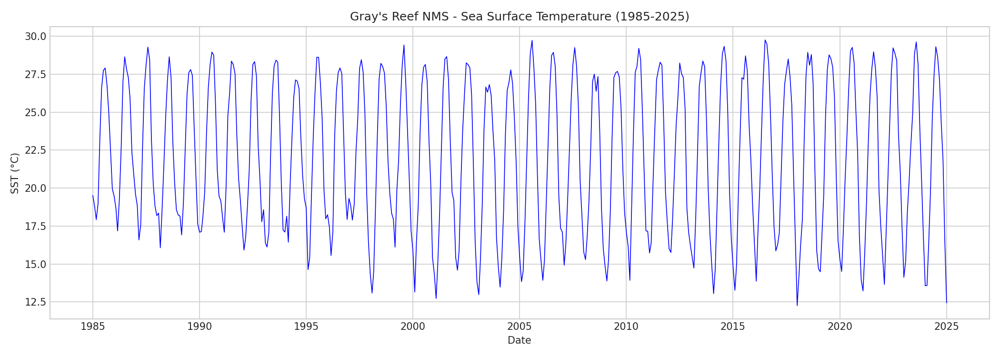
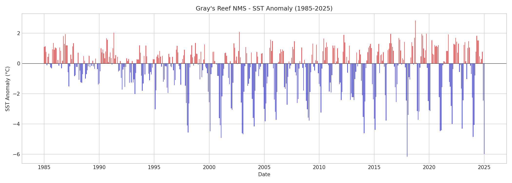
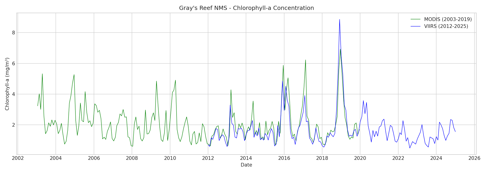
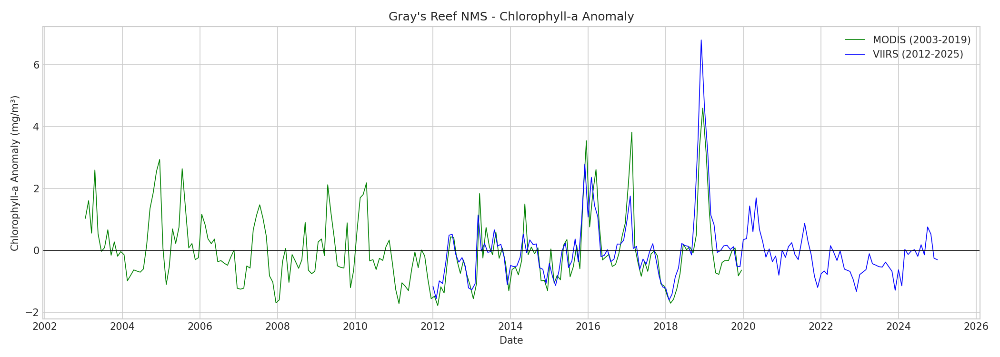
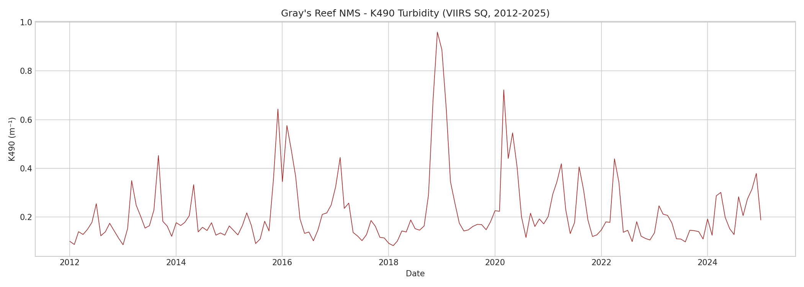
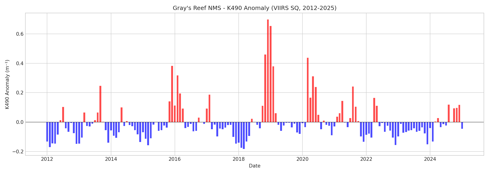
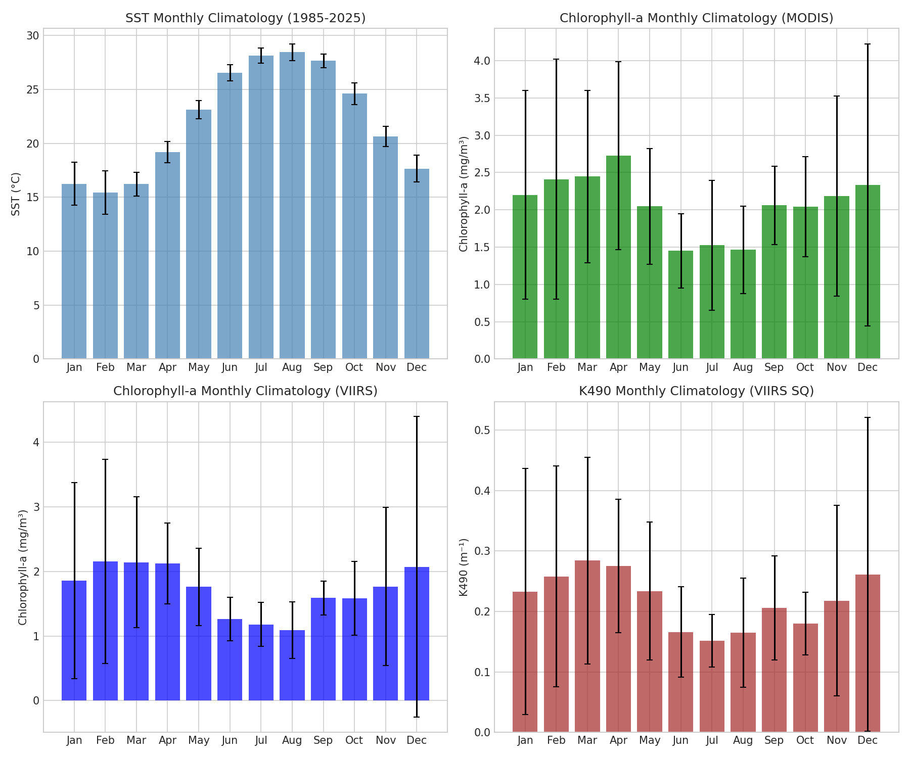

# Gray's Reef National Marine Sanctuary - Environmental Data

This repository contains oceanographic environmental data for **Gray's Reef National Marine Sanctuary** (NMS), located off the coast of Georgia, USA.

## Study Area

- **Location**: Southeast US Atlantic Coast, offshore Georgia
- **Coordinates**: 31.36°N - 31.42°N, 80.82°W - 80.93°W
- **Sanctuary**: [Gray's Reef NMS](https://graysreef.noaa.gov/)

## Data Sources

All data are downloaded from NOAA CoastWatch ERDDAP servers:

| Variable | Source | Dataset ID | Resolution | Time Range |
|----------|--------|------------|------------|------------|
| Sea Surface Temperature (SST) | Coral Reef Watch v3.1 | `NOAA_DHW_monthly` | 5 km | **1985-2025** |
| SST Anomaly | Coral Reef Watch v3.1 | `NOAA_DHW_monthly` | 5 km | **1985-2025** |
| K490 Turbidity | VIIRS Science Quality | `noaacwNPPVIIRSSQkd490Monthly` | 750 m | **2012-2025** |
| Chlorophyll-a (VIIRS) | VIIRS Science Quality | `noaacwNPPVIIRSSQchlaMonthly` | 750 m | 2012-2025 |
| Chlorophyll-a (MODIS) | MODIS Aqua | `erdMH1chlamday_R2022SQ` | 4 km | **2003-2019** |

## Data Files

### Time Series

These files contain **spatially-averaged monthly values** - one row per month:

| File | Variables | Period | Rows |
|------|-----------|--------|------|
| `sst_timeseries.csv` | time, sea_surface_temperature, sea_surface_temperature_anomaly | **1985-2025** | **481** |
| `chlorophyll_timeseries.csv` | time, chlor_a, chlor_a_anomaly | 2012-2025 | 154 |
| `chlorophyll_modis_timeseries.csv` | time, chlor_a, chlor_a_anomaly | **2003-2019** | **204** |
| `k490_viirs_sq_timeseries.csv` | time, kd_490, kd_490_anomaly | **2012-2025** | **157** |

### Raw Gridded Data

These files contain the **original gridded data** - multiple lat/lon points per timestep:

| File | Description |
|------|-------------|
| `sst_raw.csv` | SST & anomaly, all grid points (1989-2025) |
| `chlorophyll_viirs_raw.csv` | Chlorophyll-a VIIRS, all grid points (2012-2024) |
| `chlorophyll_modis_raw.csv` | Chlorophyll-a MODIS, all grid points (2003-2019) |
| `k490_modis_raw.csv` | K490 turbidity, all grid points (2003-2024) |

## Variable Descriptions

| Variable | Units | Description |
|----------|-------|-------------|
| `sea_surface_temperature` | °C | Sea surface temperature |
| `sea_surface_temperature_anomaly` | °C | Deviation from climatological mean (from Coral Reef Watch) |
| `chlor_a` | mg/m³ | Chlorophyll-a concentration (proxy for phytoplankton) |
| `chlor_a_anomaly` | mg/m³ | Chlorophyll-a deviation from monthly climatology |
| `kd_490` | m⁻¹ | Diffuse attenuation coefficient at 490nm (water clarity/turbidity) |
| `kd_490_anomaly` | m⁻¹ | K490 deviation from monthly climatology |

## Quick Start (R)

```r
# Load time series data
sst <- read.csv("data/sst_timeseries.csv")
chlor_viirs <- read.csv("data/chlorophyll_timeseries.csv")
chlor_modis <- read.csv("data/chlorophyll_modis_timeseries.csv")
k490 <- read.csv("data/k490_viirs_sq_timeseries.csv")

# Convert time column to Date
sst$time <- as.Date(sst$time)
chlor_viirs$time <- as.Date(chlor_viirs$time)
chlor_modis$time <- as.Date(chlor_modis$time)
k490$time <- as.Date(k490$time)

# Plot SST (40 years: 1985-2025)
plot(sst$time, sst$sea_surface_temperature, type="l",
     xlab="Date", ylab="SST (°C)",
     main="Gray's Reef NMS - Sea Surface Temperature (1985-2025)")

# Plot Chlorophyll anomaly (MODIS: 2003-2019)
plot(chlor_modis$time, chlor_modis$chlor_a_anomaly, type="l", col="green",
     xlab="Date", ylab="Chlorophyll-a Anomaly (mg/m³)",
     main="Gray's Reef NMS - Chlorophyll-a Anomaly (MODIS, 2003-2019)")
```

## Files in This Repository

```
Grays-Reef-Coastwatch/
├── README.md                    # This file
├── grays_reef_analysis.ipynb    # Jupyter notebook with analysis
├── extract_grays_reef.py        # Python script for data extraction
├── download_data.sh             # Bash script for data download
└── data/                        # CSV data files
    ├── sst_timeseries.csv              (481 months, 1985-2025)
    ├── sst_raw.csv
    ├── chlorophyll_timeseries.csv      (VIIRS, 154 months, 2012-2025, with anomaly)
    ├── chlorophyll_modis_timeseries.csv (MODIS, 204 months, 2003-2019, with anomaly)
    ├── k490_viirs_sq_timeseries.csv    (VIIRS SQ, 157 months, 2012-2025, with anomaly)
    └── ... (raw data files)
```

## Data Summary

### SST (1985-2025) - 40 years
- **481 monthly records**
- Temperature range: 12.3 - 29.8°C
- Anomaly range: -6.2 to +2.8°C

### Chlorophyll-a (with anomaly)
- **MODIS (2003-2019)**: 204 months, concentration + anomaly
- **VIIRS (2012-2025)**: 154 months, concentration + anomaly

### K490 Turbidity (VIIRS SQ, 2012-2025)
- **157 monthly records** (with anomaly)
- Range: 0.082 - 0.96 m⁻¹

## Plots

### Sea Surface Temperature (1985-2025)


### SST Anomaly (1985-2025)


### Chlorophyll-a Concentration


### Chlorophyll-a Anomaly


### K490 Turbidity (VIIRS SQ, 2012-2025)


### K490 Anomaly


### Monthly Climatology


## References

- NOAA CoastWatch: https://coastwatch.noaa.gov/
- ERDDAP: https://coastwatch.pfeg.noaa.gov/erddap/
- Gray's Reef NMS: https://graysreef.noaa.gov/
- Coral Reef Watch: https://coralreefwatch.noaa.gov/
